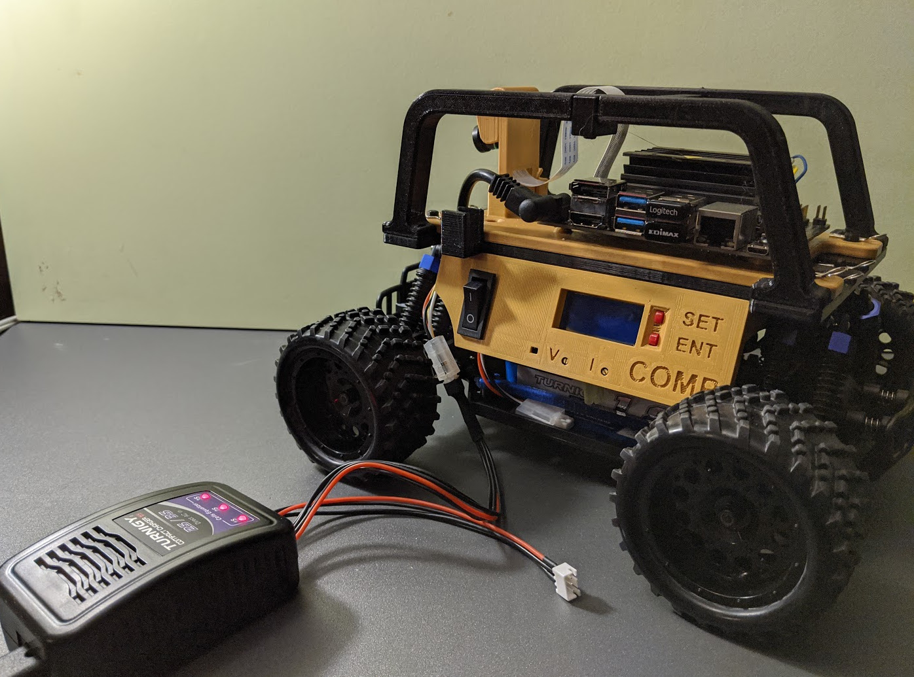
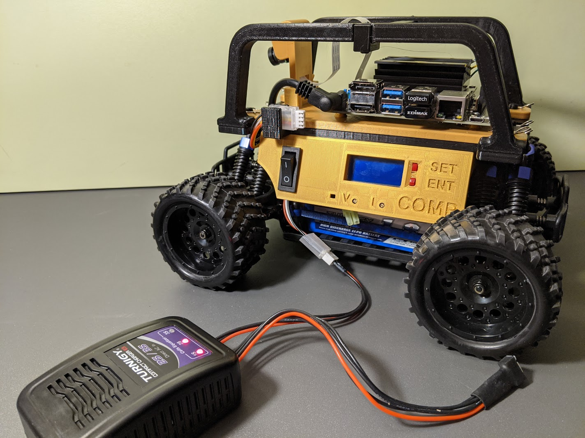

The charger is capable of charging both the 2S and 3S batteries.  There is a balancing port for each type.  Only one battery may be charged at a time.

The charging leads on the batteries are rather short, so JST-XH extension cables are used to solve this problem.
They provide one additional benefit, in that wear and tear happens on the extension cable and not the charger connector.

To charge a battery, just lift the charging cable from the housing on the car and plug it into the appropriate extensin cable on the charger.
The cable housing on the car is there to hold the cable in place so it can't fall down and get caught in the wheel.

Charging Processor Battery:

 

Charging Drive System Battery:

 

