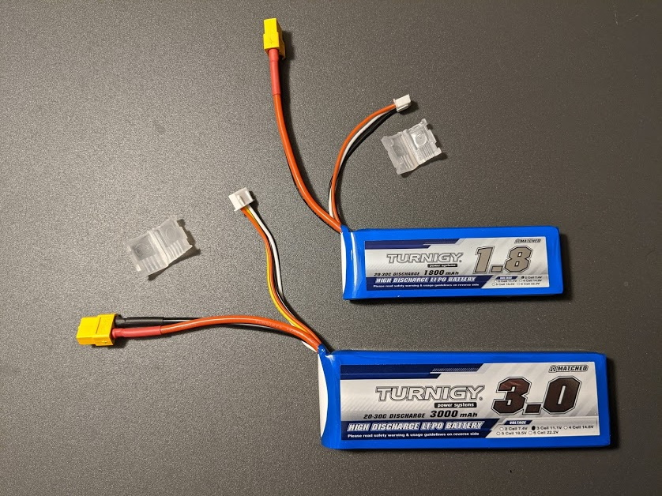
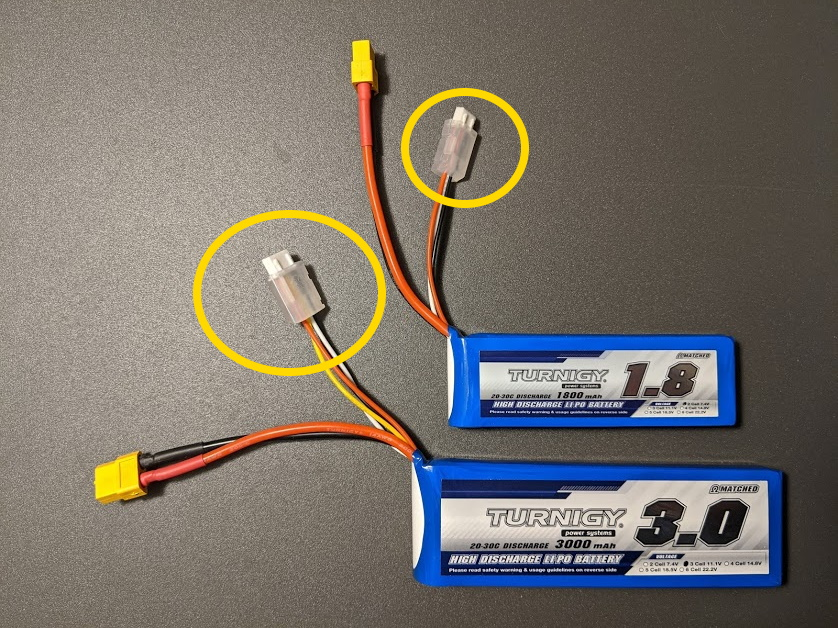

## Install Charge Cable Protectors

Place the charging cable protector on each battery.
There is a 3-wire protector for the 2S battery and a 4-wire protector for the 3S battery.
These protectors give you something to grab when plugging in the charging cable as well as they hold the cable in-place while the car is running.

 

The protector has slots for the connector to slide into as well as wire guides on the back side.

 

