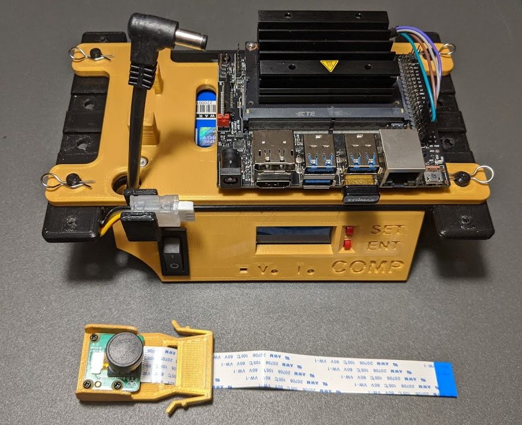
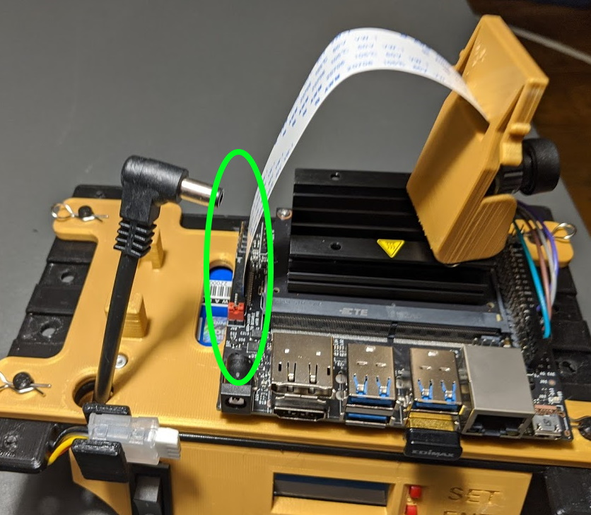
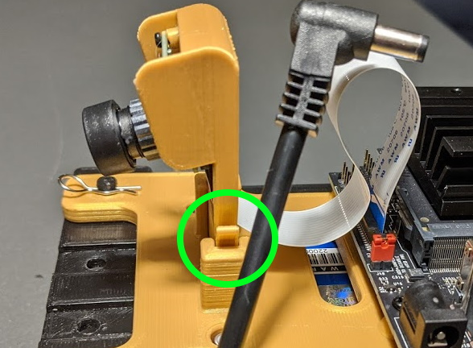

## Raspberry Pi (CSI) Camera Mount

 

## Camera Cable Connection

The CSI cable connector is very fragile, so extreme care must be taken while inserting the cable. [JetsonHacks](https://www.jetsonhacks.com/2019/04/02/jetson-nano-raspberry-pi-camera/) has a good demonstration of this process.

* Following the JetsonHacks advice, insert the camera cable into the Jetson Nano as shown.

 

## Chassis Mount

The camera fixture simply slips into the camera mount on the front of the car.

* Squeeze the latching clips together while inserting the camera.
* When fully inserted, a click will be heard.

 

