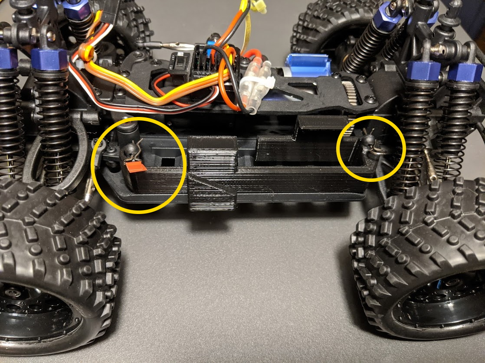
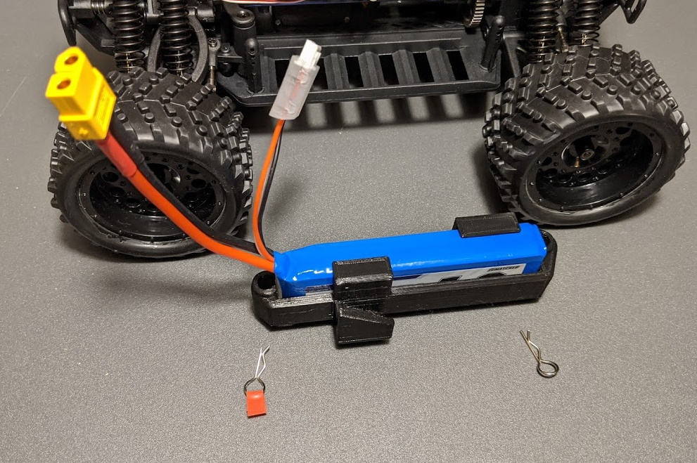
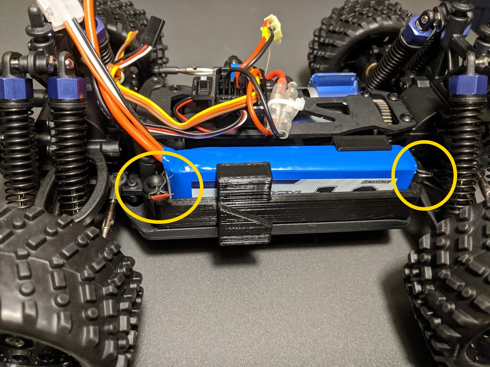
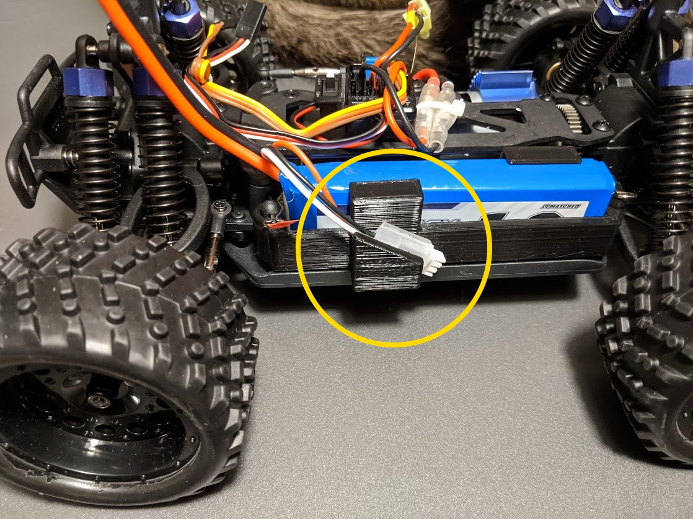

## Remove Battery Holder

Remove the battery holder on the left side of the car chassis.
It is held in place by two spring clips.

The clip on the front is tagged with a piece of red tape.
This clip is special.
It had to be shortened slightly so it would not come in contact with the steeringcolumn behind it.
The original car had this post turned 90 degrees, but the flange at the bottom of the post got in the way of inserting the LiPo battery.
The LiPo battery is a little larger than the original NiMH battery and thus the need for a whole new battery holder.

 

## Install Battery in Holder

Insert the 2S battery (1.8Ah) in the battery holder.
This can be a little tricky as the wires want to bind up on the front of the holder.

 

## Insert Assembly in Car

Insert the battery and holder back into the car and secure with the clip pins.

 

Secure the charging cable into the slot on the side of the battery holder.

 

