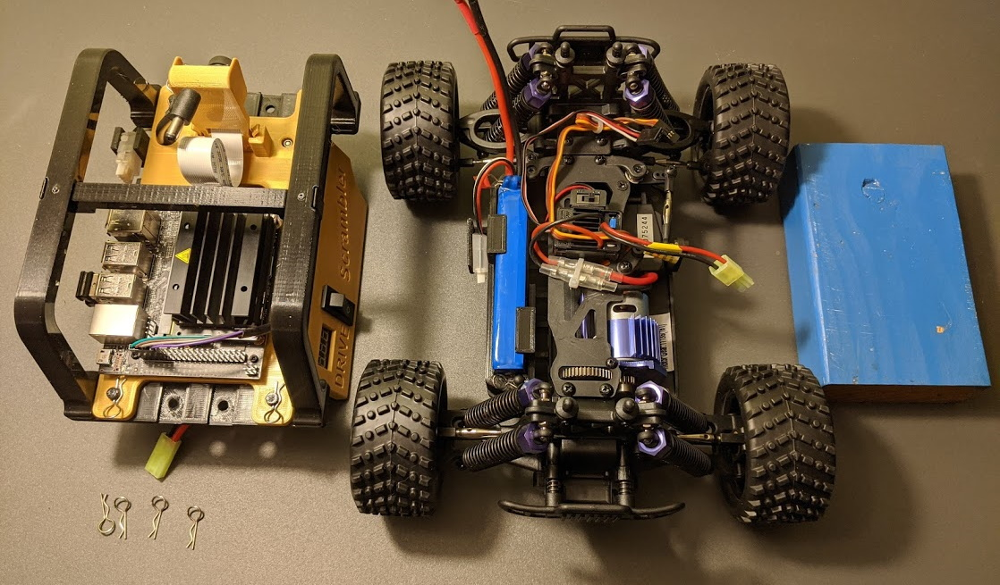
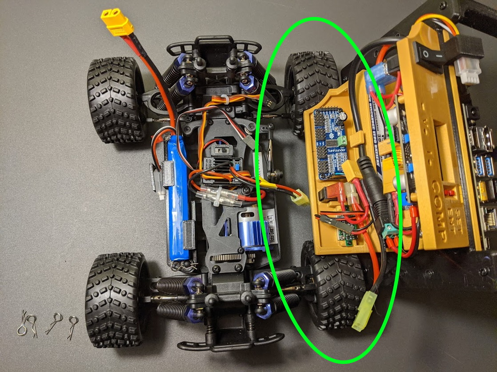
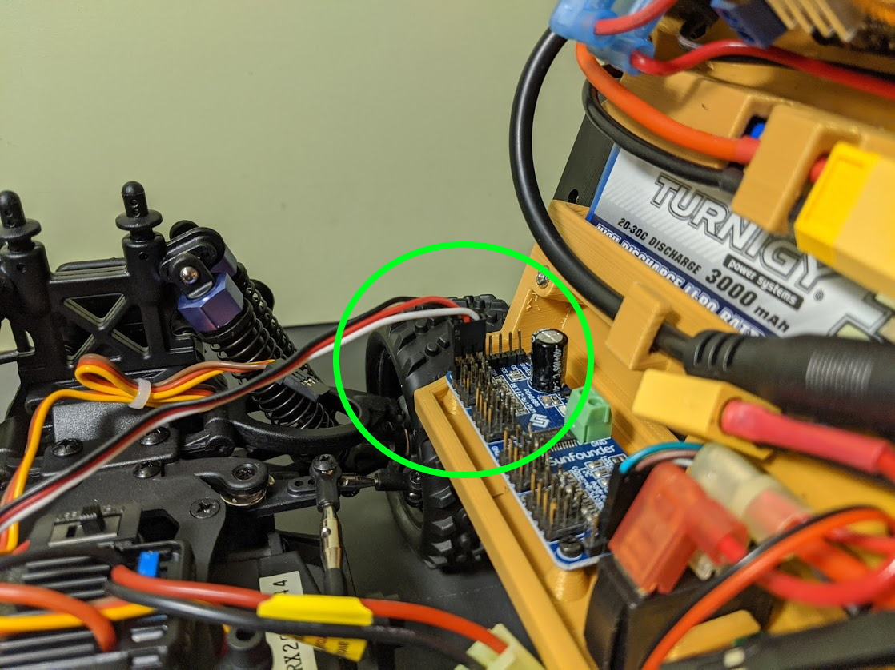
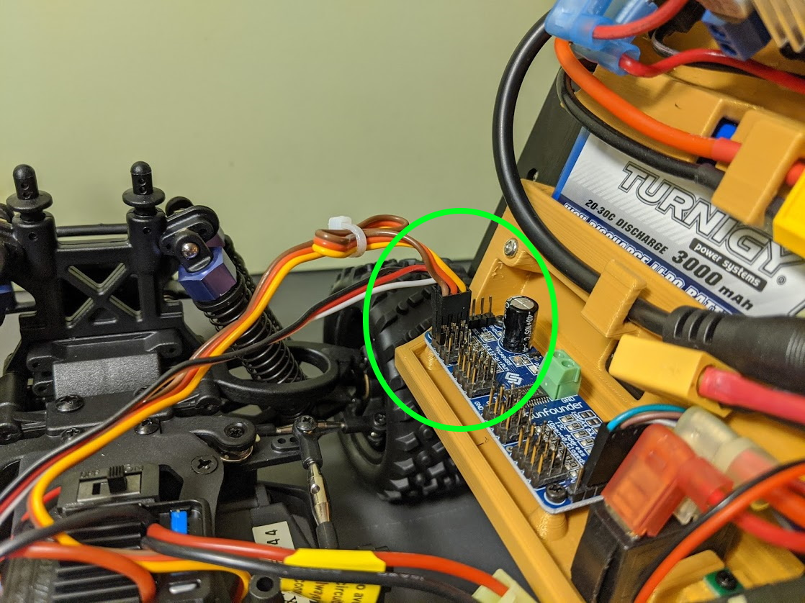
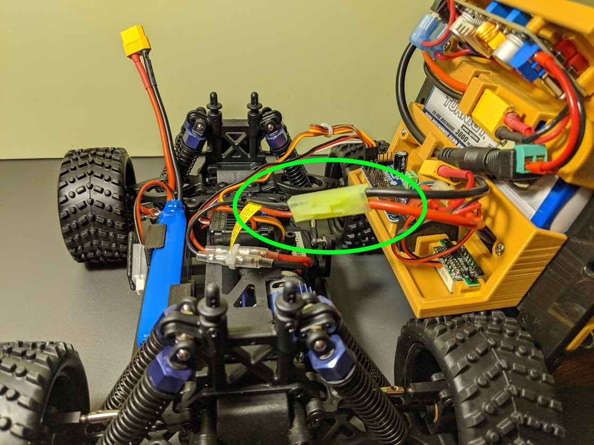
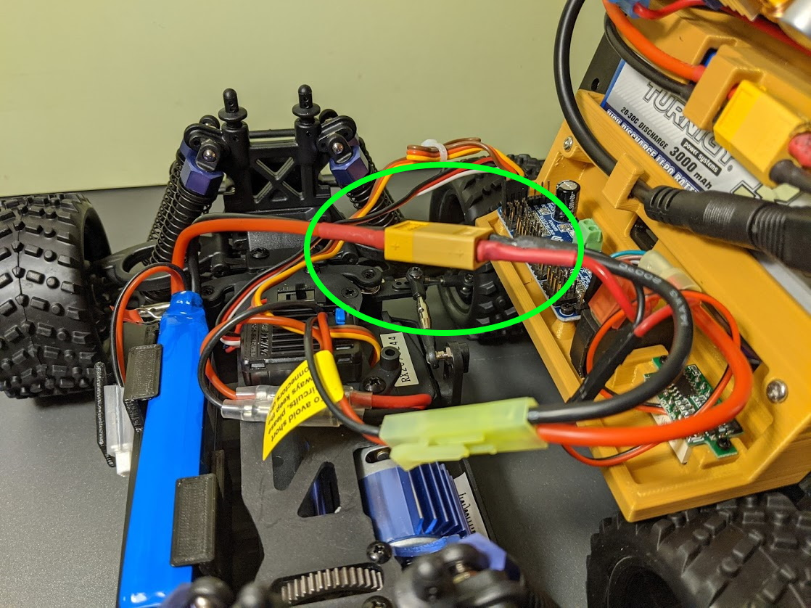
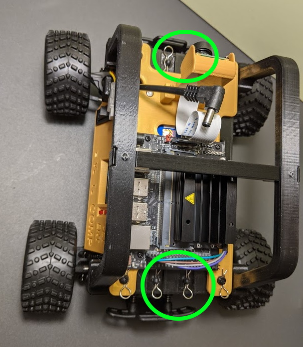

## Connecting Car Top to Chassis

The car top contains the bulk of the electronics.
Only a few connections are needed before securing to the chassis.

To aid in the connection process, a small 2x4 is handy to support the car top.

 

## Connect PWM Wires

* Position the car top on the right tires and block of wood as shown.

 

* Connect the drive motor control wires to PWM Port 0. This is the 3-wire cable that is white/red/black.  The black lead (gnd) goes to the outside edge of the circuit board.

 

* Connect the steering servo cable (yellow/orange/brown) to PWM Port 1. The brown lead (gnd) connects to the outside edge of the circuit board.

 

## Connect Power Wires

* Connect the motor controller power lead (mini tamiya connector) to the right car panel.

 

* Connect the Drive Battery (XT-60 connector) to the right control panel.

 

## Mount Top to Chassis

* Carfully roll car top over and position any hanging wires to the center of the car.
* Insert car top on chassis mounting posts.
* Secure with four bent clips.

 

