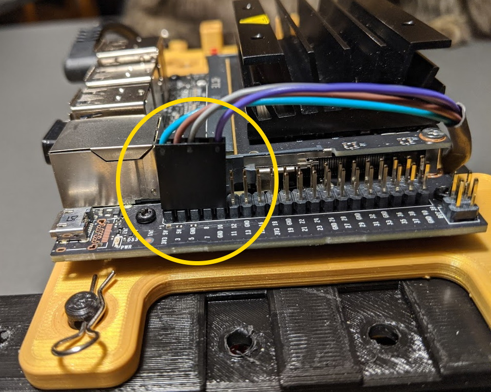
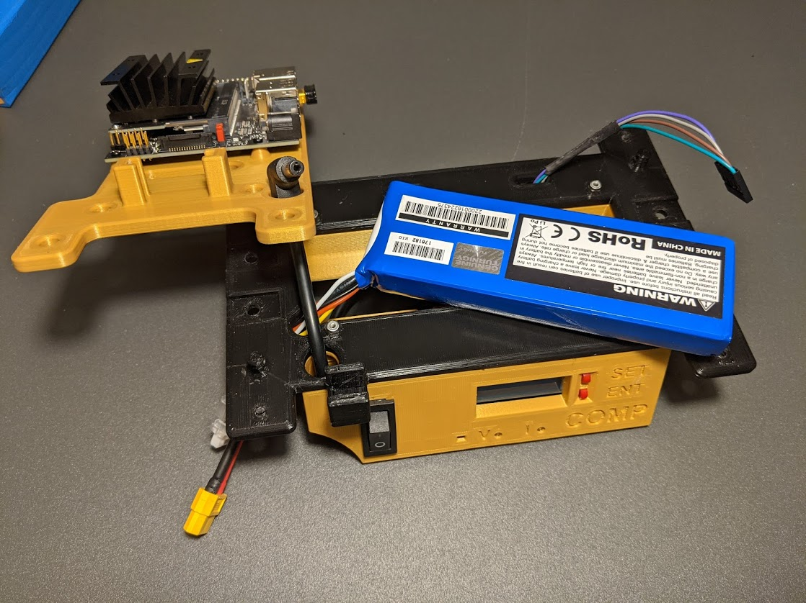
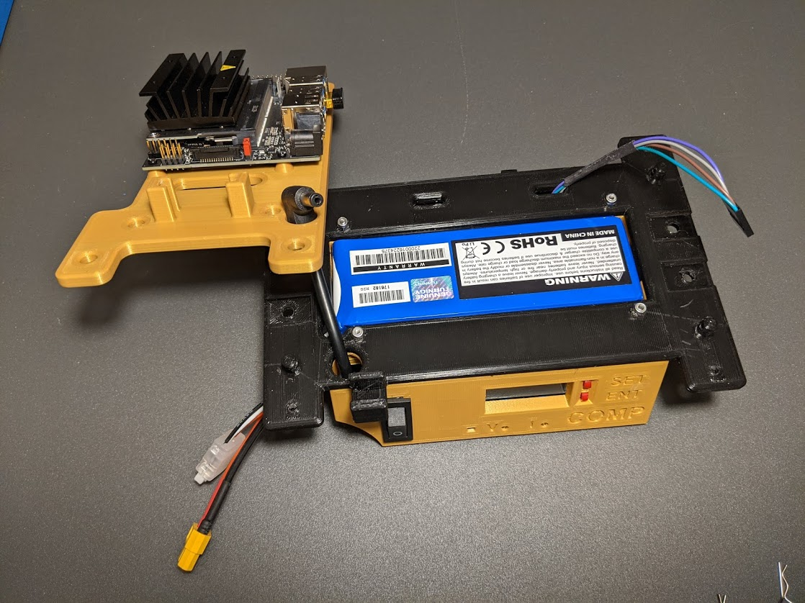
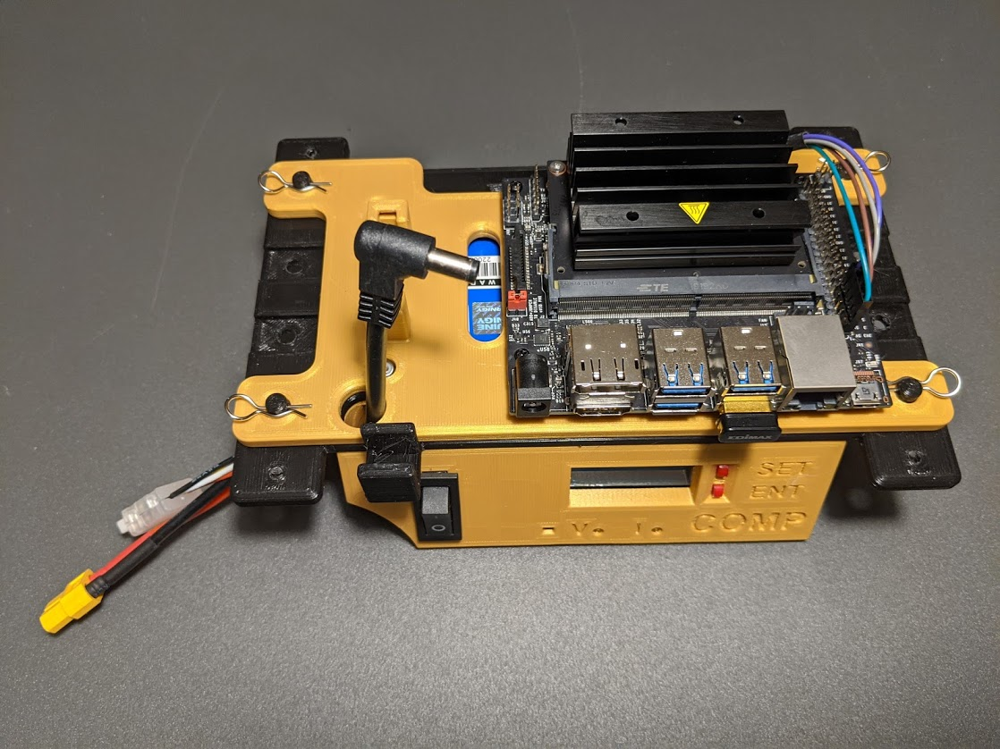
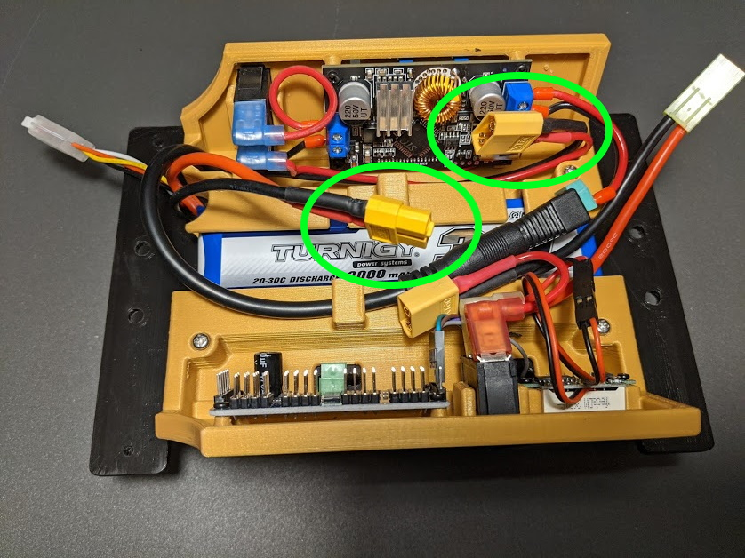
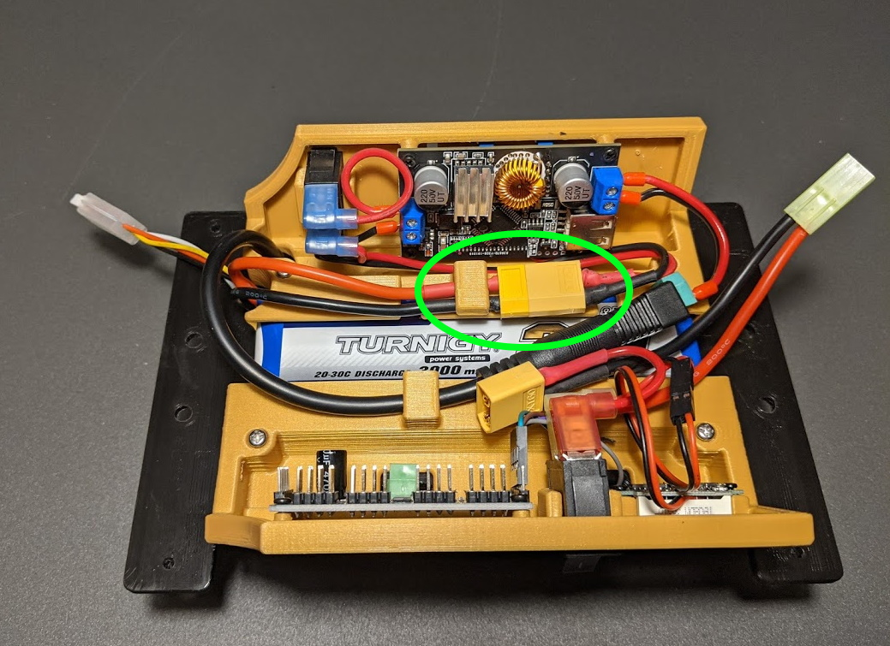
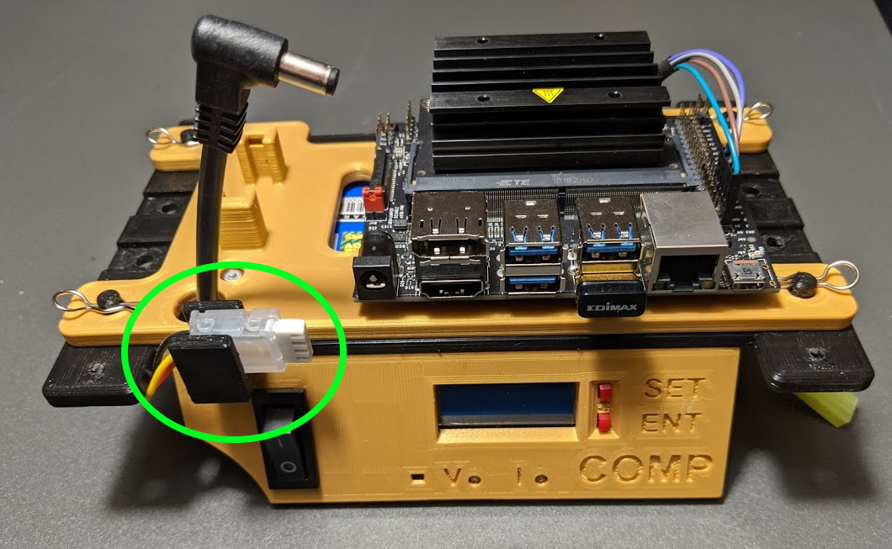

## I2C Control Cable

* Take note of how the I2C Control Cable is plugged in to the Jetson Nano.
It plugs into the outter row of pins with the gap between wires to the right.
* Unplug this cable.
* Pull the four clip pins holding the processor mounting plate in place.
Note, one pin is shown in the picture.

 

## Insert Battery into Holder

* Rotate the processor out of the way.
* Slip the processor battery cables down through the slot in teh front of the car.

 

* Slide battery into slot.

 

## Reinstall Processor Plate

* Rotate mounting plate back into place.
* Secure with four clip pins.
* Reconnect the I2C Control Cable.

 

## Connect Power Cable

* Insure power switches are off.
* Turn processor assembly upside down.
* Route the processor battery cable under the 5V cable as shown.

 

* Mate the two XT-60 connectors.
* Place the battery wire under the retaining clip as shown.

 

## Stow Charging Cable

* Flip assembly right side up again.
* Place the charging cable in the slot on the left side of the car.

 

