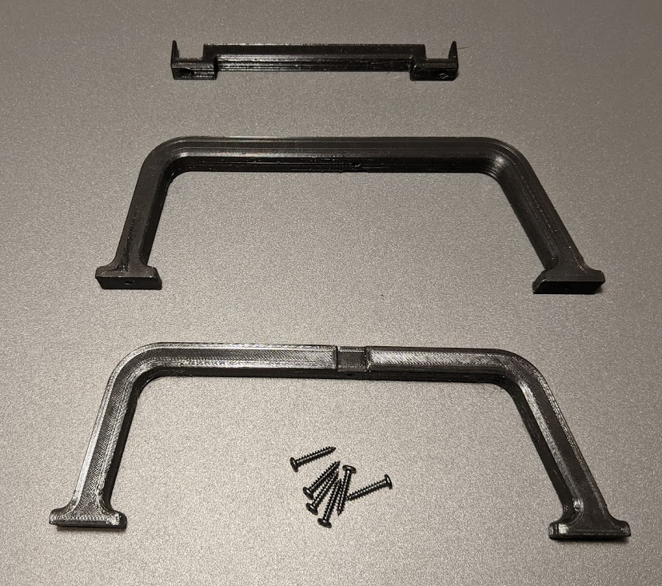
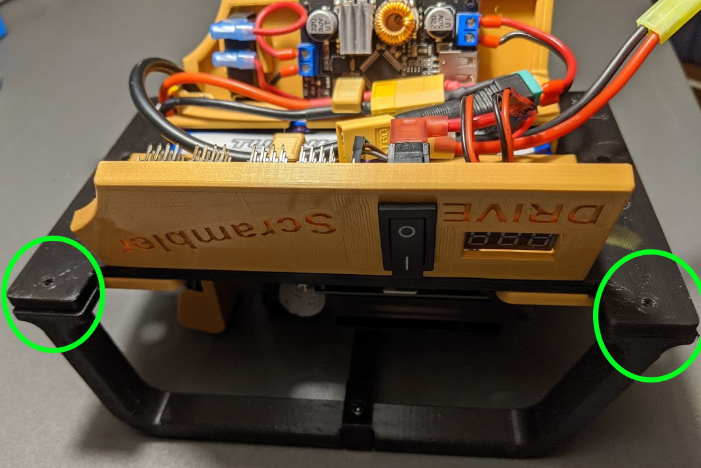
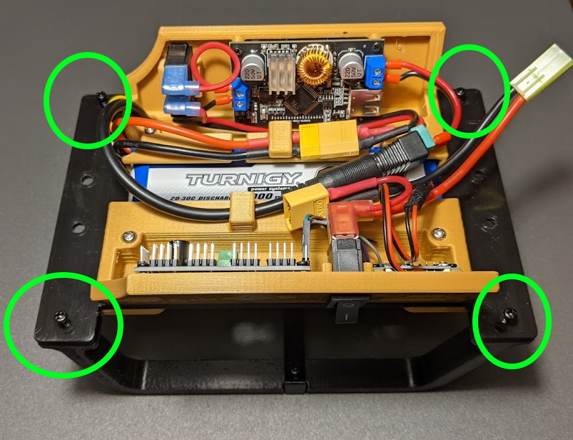

## Roll Bar

The roll bar assembly consists of a left and right roll bar with a support cross piece.  Six screws connect it all together and to the car.

| Quantity 	| Part 	| Notes 	|
|----------	|------------------	|-------	|
| 1 	| Left Roll Bar 	|  	|
| 1 	| Right Roll Bar 	|  	|
| 1 	| Roll Bar Support 	|  	|
| 6 	| 3M x 14mm screws 	|  	|

 

## Assemble Roll Bars

* Connect the two roll bars together with the support cross piece and two screws.

 

## Attach to Car

* Place the roll bars upside down.
* Invert the car top and set on bars as shown.
Note: the most vertical part of the roll bar goes toward the front of the car.
This provides the most protection for the camera.

 

* Attach with four screws.

 

Completed Roll Bar Assembly.

 

