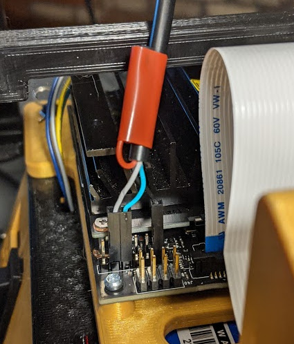

This section lists some general things that may be observed through operation.

# Processor Power Current Limiting

If the orange light comes on on the processor panel, the regulator has gone into current limit mode.
This light can be seen through the rectangular hole on the processor panel near the V adjustment area.
This should not happen under normal operation.
Causes of this are a short in the output, processor is drawing more power than regulator can output or the I-adjust control is set too low.
If the regulator current limits excessively, it can cause a brown-out on the processor and force it to reset.

To increase the current level output, turn the I-adjust control clockwise.

If adding electrical components to the car, it is important to note that the regulator has a current sense resistor on the ground side of the system.
Thus, the negative side of the battery is not at the same level as the 5V ground to the processor.
The drive system battery and the 5V ground end up at the same level through the wiring of the PWM module.
Should the processor battery negative lead be brought to the same level as the 5V ground, this will effectively short out the sensing resistor and damage to the regulator will result.

# Output Voltage Increases with Processor Load

If you observing the ouput voltage on the display, you may notice that it may increase as much as 0.2V as the processor pulls a heavy load.
This is normal because of the sense resistor in the ground path on the regulator.
The actual input voltage remains at the unloaded reading value.

# Car Suspension

Adding the processor battery, 3D printed parts and other electronics increases the weight of the car by about 650g (23 oz).
If the suspension appears to be sagging too much, go to the [Exceed RC](http://www.exceedrc.com) web-site for instructional videos on changing shock oil and adjusting spring tension.

# Using Jetson Nano Serial Ports

There may be times that it is useful to connect to a serial console port to gain control of the system.
There are two serial UART ports on the Jetson Nano.
The port on J44 is the system serial console port.
The other serial port is on J41.
This port is mixed in with other I/O pins.
Many users report having difficulty in connecting to the serial port on J41.
There seems to be little information on the web to help resolve this issue.
The version of firmware downloaded for this car also exhibits this problem.
For purposes of getting things up and running, only J44 will be used.

A nice tutorial by [JetsonHacks](https://www.jetsonhacks.com/2019/04/19/jetson-nano-serial-console) covers many elements of getting connected to the serial console. 

USB to TTL Cables are available from several sources.
[This](https://amazon.com/gp/product/B07D9R5JFK/ref=ppx_yo_dt_b_asin_image_o02_s00?ie=UTF8&psc=1) one is readily available.
The cable is not all that long, so to make connections easier, it may be necessary to attach this cable to the host through a USB extension cable.

<div style="text-align:center"></div>
<br>

The serial device is connected to the J44 on the Jetson Nano as follows:

| J44 Pin 	| Cable Wire 	|
|---------	|-------------	|
| 2 (TXD) 	| White (RXD) 	|
| 3 (RXD) 	| Green (TXD) 	|
| 6 (GND) 	| Black (GND) 	|
| NC 	| Red (5V) 	|

The J44 port runs at logic levels of 3.3V and is not 5V compatible.
The red lead on the USB to TTL device is a 5V source and is not needed and must not be connected to pins on J44.

Note: RXD on the cable is connected to TXD on the Nano and vice versa.
This has to do with labeling conventions.

The following picture shows the connection of this device.
Also note that the 5V lead is taped up out of the way so that it cannot inadvertantly short to anything on the board.

<div style="text-align:center"></div>
<br>

There are many serial terminal emulators available.
The example here will use *screen*.

If not already installed on the host, it can be simply done via:

```
sudo apt-get update
sudo apt-get install screen
```

To discover which port the USB to TTL convertor is plugged into, open a terminal window and type the following command:

```
dmesg --follow
```

Then plug the USB device in and observe the output of dmesg.
It will typically show that the device is connected to a port such as *ttyUSB0*.

Exit out of the *dmesg* command.

Start up the terminal emulator with the command:

```
screen /dev/*<device>* 115200
```

You should now be able to login to the machine.
