# Computer Regulator Cable Construction

Three cables are needed to connect the battery through the power switch, regulator and processor.
Refer to the following pictures to construct the computer power regulator cable.

## Battery to Power Switch Cable

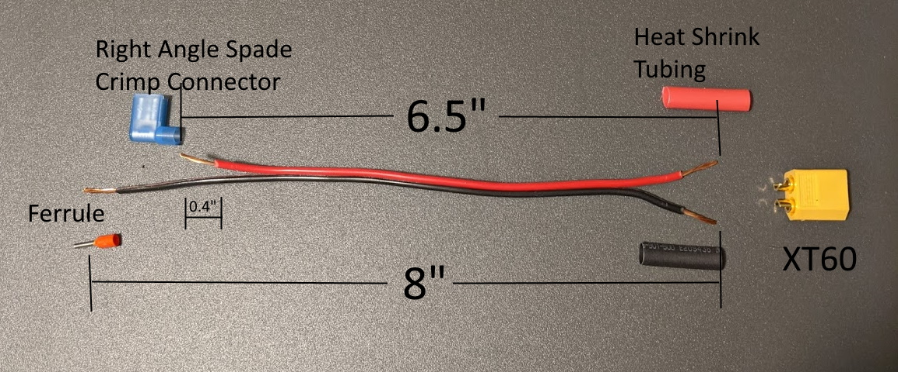

 

* Cut 8" of 18AWG Red/Black Zip Cord.
* Cut the red lead down to 6.5"
* Strip 0.4" insulation from each end of the wires.
* Solder the wires on the XT60 Male Connector with the heat shrink tubing.
* Crimp the right angle spade connector to the shortened end of the red wire.
* Crimp the ferrule on the black wire.

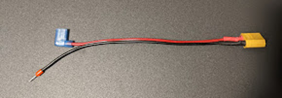

 

## Power Switch to Regulator Cable

* Cut 3.5" 18AWG Red wire.
* Strip 0.4" from each end.
* Crimp the right angle spade connector to one end of the red wire.
* Crimp the ferrule on the other end.

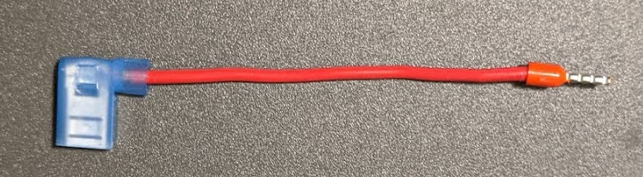

 

## Regulator to Computer Cable

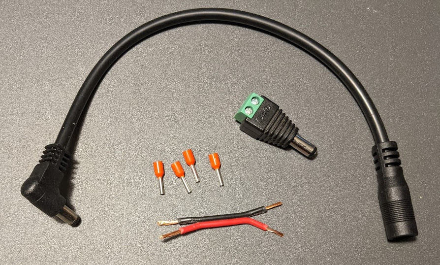

 

* Cut 2" of 18AWG Red/Black Zip Cord.
* Strip 0.4" insulation from each end of the wires.
* Crimp the ferrules on each end of each wire.
* Screw ferrules on one end of the wire into the male barrel jack.

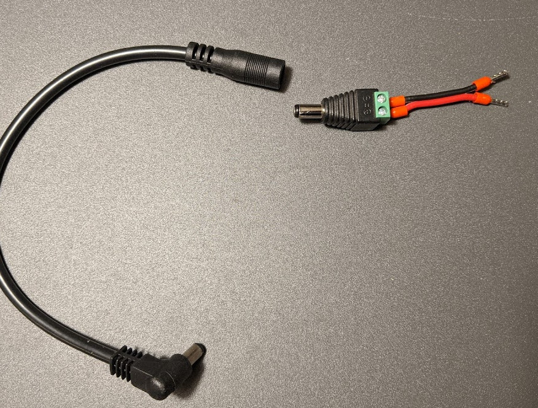

 

# Drive System Cable

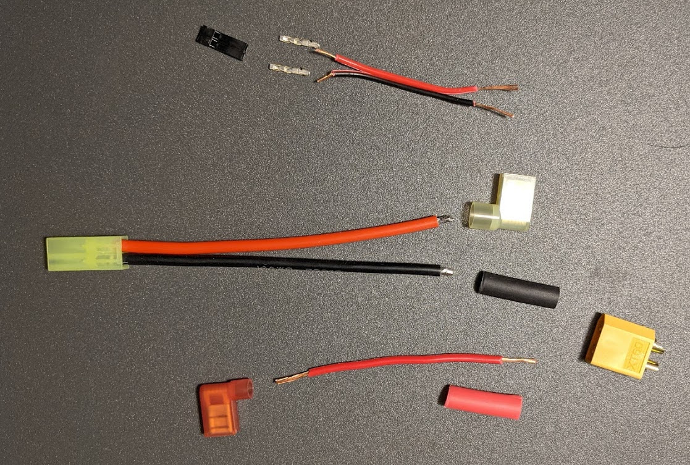

 

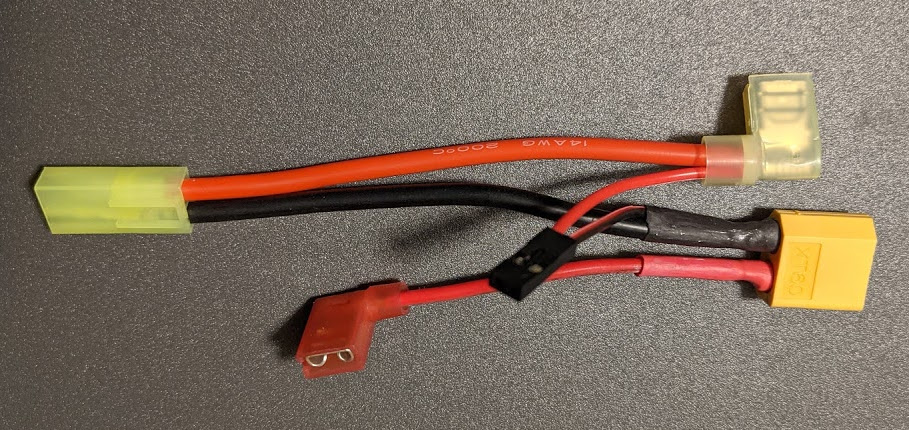

 

# I2C Drive System Control Cable

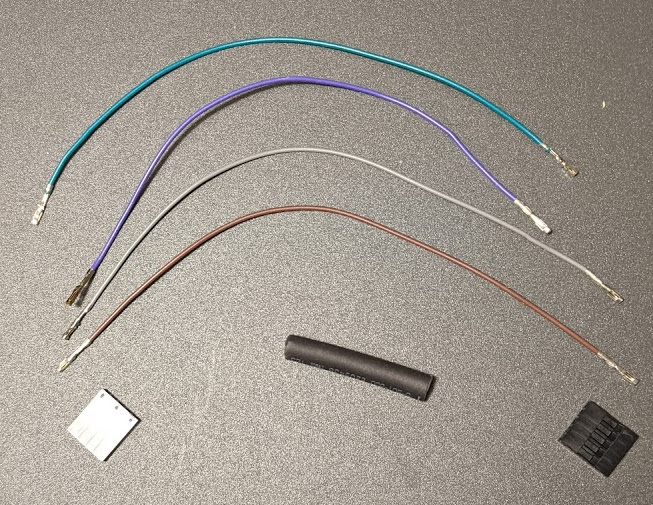

 

* Slip 1.5" heat shrink tubing over four 6.5" connector wires with female crimp connectors.
* Insert each wire into 1x5 Pin housing. The wires go into pins 1,2,3,5. The wire ordering is the same for each end.  Note pin 4 slot is unused.
* Heat the tubing so to tighly constrain the wires.

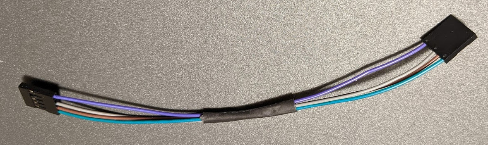

 

# Voltmeter Cable Prep

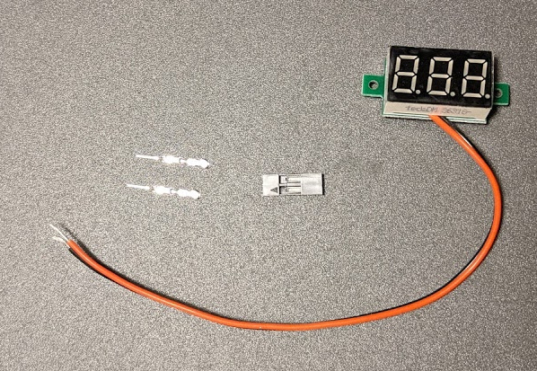

 

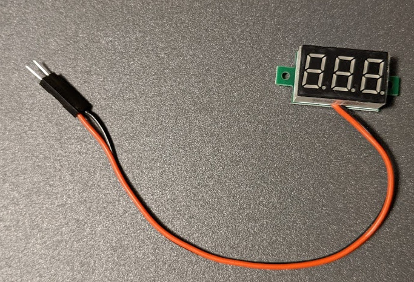

 

