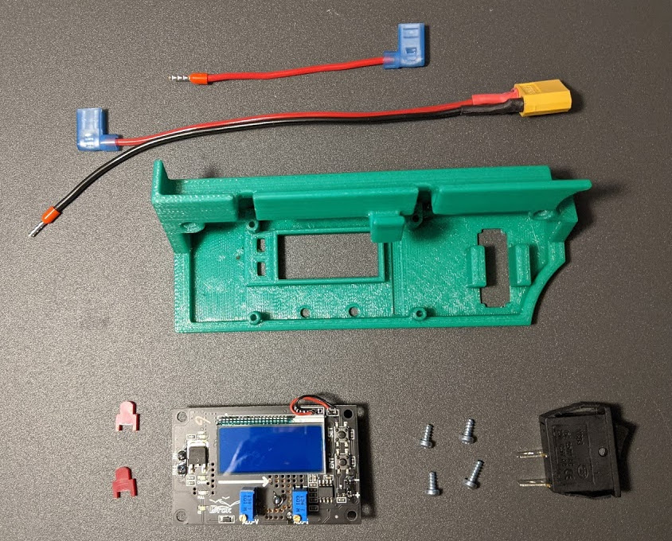
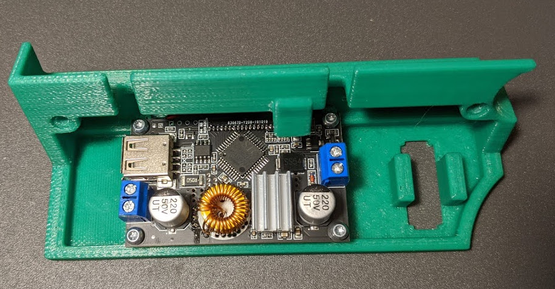
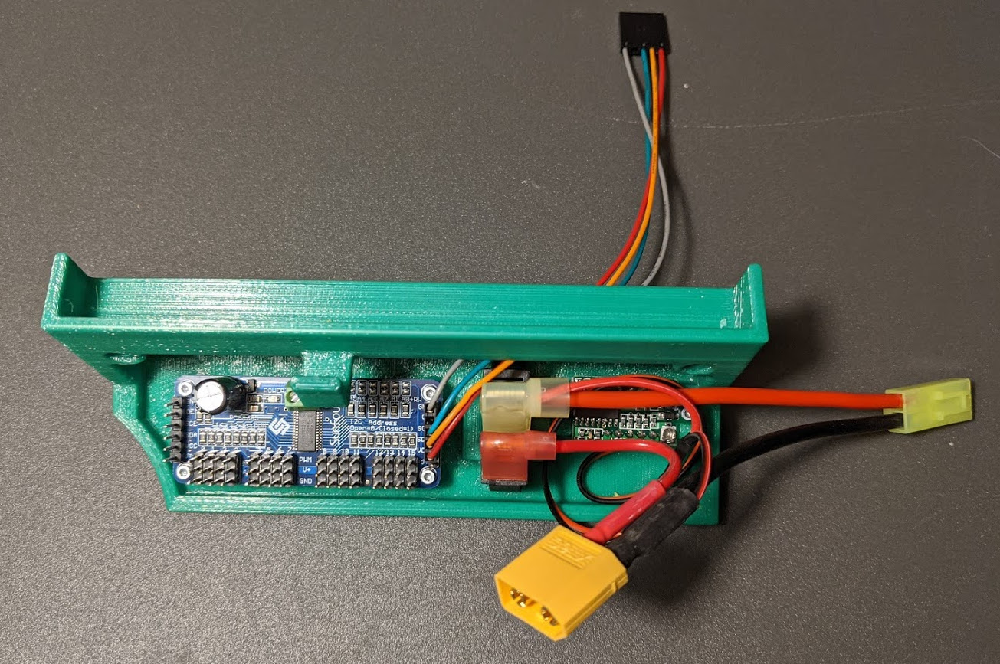
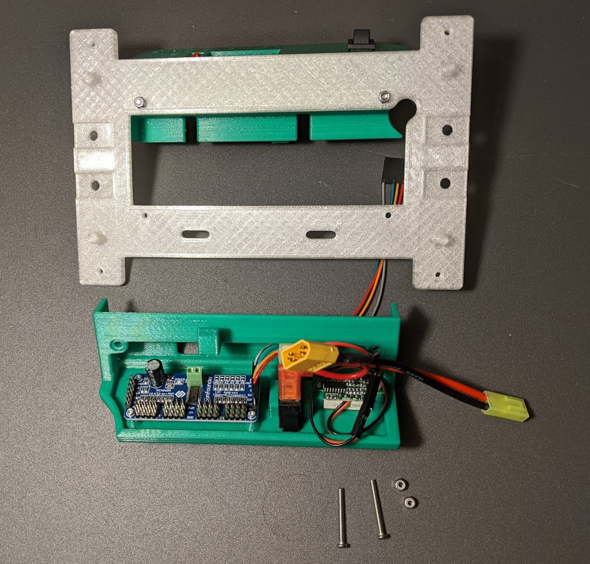
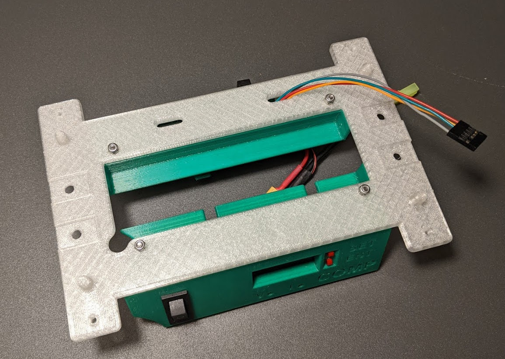
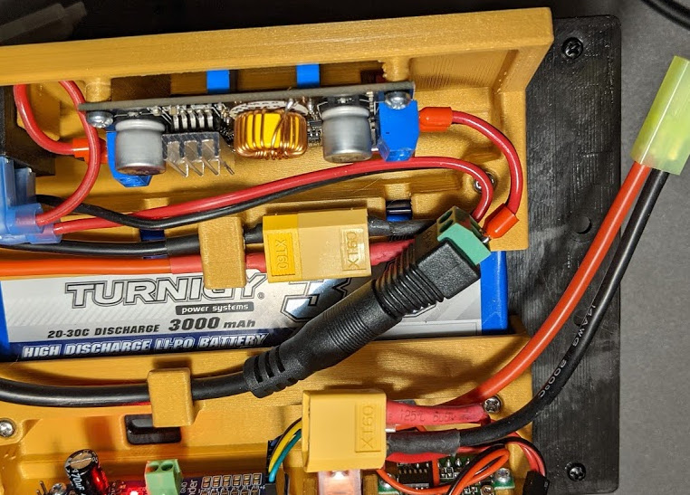

# Indroduction

This section is a work in progress.
Not all pictures will be of the current design and may contain different colors.
As this effort completes, there should be a uniform presentation from beginning to end.

# Processor Panel

The processor panel houses the power regulator for the processor and handles cabling between the battery and processor.

The following parts are used for construction:

| Quantity 	| Part 	| Notes 	|
|----------	|-------------------------------	|---------------------	|
| 1 	| 3D printed Power Panel 	|  	|
| 1 	| Battery to Switch Cable 	| Constructed in previous section 	|
| 1 	| Switch to regulator cable 	| Constructed in previous section 	|
| 1 	| Power Regulator 	| [Drok Buck Converter 180080](www.amazon.com/gp/product/B07JZ2GQJF/ref=ppx_yo_dt_b_asin_image_o02_s01?ie=UTF8&psc=1) 	|
| 2 	| Switch caps 	| Included with power regulator module 	|
| 1 	| Power Switch 	| [Rocker Switch 20A 125V](www.amazon.com/mxuteuk-Household-Appliances-Warranty-MXU3-101/dp/B07QQ22DTB/ref=sr_1_8?keywords=rocker+switch+20A+125v&qid=1580946226&s=automotive&sr=1-8) 	|
| 4 	| M2.5 x 8 mm self tapping screws 	|  	|

 

* On the 3D printed part, clean out the four regulator board mounting holes with a 5/64" drill bit.
* Clean out the two panel mounting holes with a 1/8" bit.
* Place the switch Caps in the rectangular mounting holes in the panel.

 

* Mount the regulator to the panel with four 3M x 5 mm screws.

 

* Connect the ground lead of the battery to switch cable to the negative input terminal on the regulator as shown.
* Connect the Switch to Regulator cable to the positive input terminal as shown.

 

* Mount the power switch in the panel.
* Connect the cables as shown.

 

# Connecting Processor Panel to Base

| Quantity 	| Part 	| Notes 	|
|----------	|---------------------------	|-------	|
| 1 	| 3D Printed Base Plate 	|  	|
| 1 	| Assembled Processor Panel 	|  	|
| 2 	| M3 x 24 mm screws 	|  	|
| 2 	| M3 nyloc nuts 	|  	|

 

* Clean out the eight small mounting holes in the base plate with a 1/8" drill bit.
* Connect processor panel to base plate with two M3 x 24 mm screws and nuts.

 

# Drive System Panel

| Quantity 	| Part 	| Notes 	|
|----------	|-------------------------------	|---------------------	|
| 1 	| 3D printed Drive System Panel 	|  	|
| 1 	| Power Cable 	| Constructed in previous section 	|
| 1 	| PWM Control Cable 	| Constructed in previous section 	|
| 1 	| Panel Voltmeter 	| [Adafruit mini 2-wire voltmeter](https://www.adafruit.com/product/460?gclid=Cj0KCQiA7OnxBRCNARIsAIW53B_1L6qIA-sswy-cENRT_UBB6Azx4R_npfdrgw3LSu3r-BGZ9X7eUZAaAnxyEALw_wcB) as prepared in previous section 	|
| 1 	| PWM Servo Controller 	| [PCA9685 12 Bit Servo Driver](https://www.amazon.com/gp/product/B014KTSMLA?tag=donkeycar-20) |
| 1 	| Power Switch 	| [Rocker Switch 20A 125V](www.amazon.com/mxuteuk-Household-Appliances-Warranty-MXU3-101/dp/B07QQ22DTB/ref=sr_1_8?keywords=rocker+switch+20A+125v&qid=1580946226&s=automotive&sr=1-8) 	|
| 4 	| M2.5 x 8 mm self tapping screws 	|  	|
| 2 	| M2 x 5 mm self tapping screws 	|  	|

 

* Clean out the four PWM module mounting holes in the Drive System Panel with a 5/64" bit.
* Clean out the two voltmeter mounting holes in the Drive System Panel with a 1/16" bit.
* Mount the servo controller as shown with four M2.5 x 8 mm screws.
* Mount the voltmeter with two M2 x 5 mm screws.
* Insert the power switch as shown.

 

* Connect the PWM Control Cable as shown.  The side with the gap between the wires goes to the top of the connector on the PWM board (gnd).
* Connect the power cable to the power switch and voltmeter as shown.
* Push on the connector to bend the lugs on teh power switch upwards. This will provide proper clearance between the power switch and the car motor.

 

# Connecting Drive System Panel to Base

| Quantity 	| Part 	| Notes 	|
|----------	|---------------------------	|-------	|
| 1 	| 3D Printed Base Plate 	|  	|
| 1 	| Assembled Drive System Panel 	|  	|
| 2 	| M3 x 24 mm screws 	|  	|
| 2 	| M3 nyloc nuts 	|  	|

 

* Route the PWM Cable through the base slot as shown.
* Connect Drive System panel to base plate with two M3 x 24 mm screws and nuts.

 

# Processor Mount Plate Attachment

* Clean out processor mounting hole on processor mounting plate with 5/64" drill bit.
* Place the Processor Mounting Plate on top as shown to enclose the battery.
* Secure with 4 bent clip pins.

# 5V Barrell Cable Attachment

| Quantity 	| Part 	| Notes 	|
|----------	|---------------------------	|-------	|
| 1 	| 3D Printed Assembly 	|  	|
| 1 	| Assembled 5V Power Cable 	|  	|
| 1 	| 5V Extension Cable 	|  	|

* Insert straight round end into the large round hole in the top of the chassis.
* Screw the ferrules on the end of the assembled 5V power cable into the output of the regulator.

 

* Plug the barrell jack on the other end into the extension cable

 

