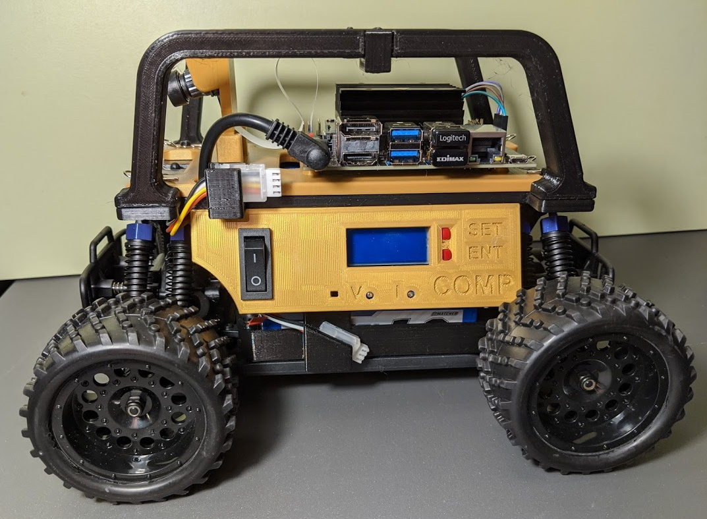

 

The principle goal of this project was to enhance the donkey car so that more useful and productive time can be obtained while the car and processor are operating fully off batteries.

To hold the necessary electronics three layers of printed materials form a sandwich that is mounted to the chassis.
The center layer is the base layer from which the other components are mounted.

Below this base layer are the two side panels.
These panels are bolted to the base with M3x24mm screws with nyloc nuts.
Bolts and nuts are used here so that we don't rely on integrety of the Z-axis filament strength to hold things together.

The left side panel, houses the power switch and voltage regulator for the processor.
The right side panel, houses a power switch, panel voltmeter and the servo controller for the drive system.

These two panels together form a cavity for holding the computer battery which is a 3 cell LiPo battery.

Above the center or base layer is mounted the processor and camera mounting board.
This layer finishes the enclosure of the processor battery.
To make battery access easy, this layer is held in place by bent spring clips that are used in several places on the car.

