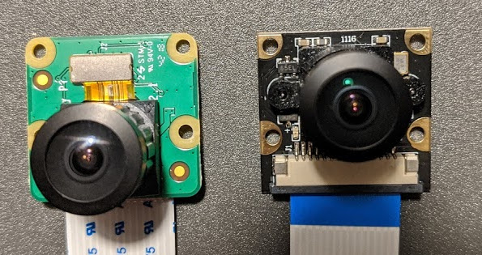

# Camera Differences

Two main camera types are Specified for use with the Jetson Nano.
For the jetbot construction, one option is to use a Raspberry Pi Camera V2 along with a wide angle camera lense attachment.
Another is a camera from Lenard Imaging.
A camera specified for the donkeycar is the Sainsmart Wide Angle Camera for the Raspberry Pi.
The Sainsmart and Lenard Imaging cameras have the same construction which is different than the Raspberry Camera.
The following picture shows a side-by-side comparision of the two.

The camera on the left is the Raspberry PI Camera with the wide angle lense attachment and the one on the right is the Sainsmart camera.

The Raspberry Pi Camera has circuitry on the back of the board which sticks up around 3mm, so any mounting fixture will require standoffs to account for this.
The cable connector also is mounted to the back of the board.

The Sainsmart Camera has the circuitrty on the front of the board along with the cable connector.
The back of the board only has two small screws which stick up only 1mm.

The most significant difference is because the connectors are mounted on opposite sids of the board, the cable gets plugged in 180 degrees different.
This means that in one implentation the cable will either require a twist to plug it into the nano, or be routed over the top of the camera.
A twist in the cable is certainly doable, but it is rather unsightly in an otherwise clean design.

# Caution on Cameras

Not all Pi Cameras work on the Jetson Nano, even ones linked by reputable references.
Instead of looking to be general in what camera to use, we'll restrict the camera mount to only address a known working camera.
This camera is the [RPi Camera V2](https://www.amazon.com/Raspberry-Pi-Camera-Module-Megapixel/dp/B01ER2SKFS/ref=sr_1_3?keywords=Rpi+camera&qid=1580704948&sr=8-3) and for wide angle lenses, use the [160-degree FoV](https://www.amazon.com/dp/B07HMXJ9Y1/ref=cm_sw_su_dp).
