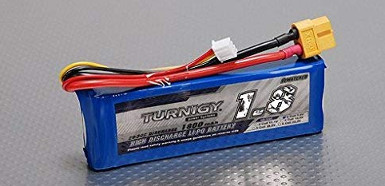

# Drive Motor Power Changes

The NiMh battery was replaced with a 1.8 Ah LiPo battery.  This battery was just enough larger that it didn't fit into the battery holder.  Also, care needed to be taken to keep it away from one of the drive gears.

In addition, a small panel volt meter and power switch was added.

By knowing the characteristics of the battery and the current voltage, a sense of the level of discharge can be determined.  The battery characteristics are described below.

The power switch is placed on the side of the car so that it can be easily accessed.

The LiPo battery has a separate balanced charging cable, so it is not necessary to unplug from the motor circuitry for charging.

# Computer Power Source

The power specification to run the Nano at full performance, supply is 4A at 5V.
This accounts for a reasonable peripheral load on the processor.
The RC LiPo battery world has many batteries capable of supplying the necessary current.
We need the largest battery that will comfortably fit on the car.
A 3 cell, 3000 mAh battery fits this need.

Three cells produce a nominal voltage of 11.1V, so we will need a buck convertor that is capable of producing 5V at 4A.
A Drok 180078 adjustable buck convertor can easily handle this.  It also has a built-in voltage and current display. 

# Convertor setup and calibration

The test circuit to set up and calibrate the convertor is the same as the circuit for running in the car, except that the processor is replaced by a high wattage resistive load (approximately 1.7 ohms).
The following image shows this configuration.

Refer to the [Drok Buck Convertor Manual](../reference/Drok-180078.pdf) for how to operate the convertor and details for the calibration process.

Calibration process:

1. Apply power to the test circuit.
2. Adjust the 'ADJ-V' and 'ADJ-I' controls so that the output is 5V and the 'Constant Current Indicator' is off.
3. Connect a voltmeter to the input terminals.  If the voltage doesn't match the display voltage, follow the 'Voltage Calibration' procedure in the manual.
4. Connact a current meter in series with the load.  If the current doesn't match the display, follow the 'Current Calibration' procedure in the manaual.
5. Short the output terminals. Adjust the 'ADJ-I' poteniometer so that the current limits to a current value of well over 3A. Note: this value should be close to 4A, to insure proper operation with the processor. Even though the regulator should output 5A, in practice it may not.

If you do not have a current meter, this article on [Measuring Low Resistance](https://www.robotroom.com/Measuring-Low-Resistances.html) can help lead to a process to establish the current calibration.

# Battery Discharge Testing

Since the processor on this car doesn't have any devices that draw significant power and Jetson Nano itself is only rated at 10W (2A at 5V), we set a reasonable maximum current draw at 3A for testing the time a battery can power the processor.

A resistive load  approximately 1.7 ohms will pull 3A at around 5V.
For purposes of this test, adjust 'ADJ-V' control so that the output current is at 3A.
While the voltage is above 9V (min load voltage) record the time each time the input voltage display drops by 0.1V.

The data collected was then used to plot the following graph.
At this load, the battery supplies sufficient power for an hour and 45 minutes.
Near the battery end-of-charge the input voltage falls off very rapidly.

