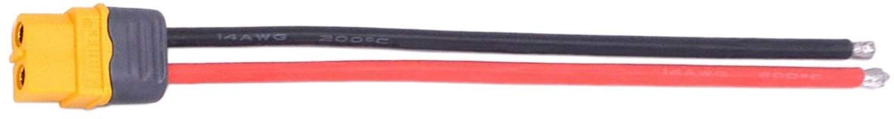

# Issues

The batteries are capable of producing high currents and thus have large diameter wires.
The space in which to connect and route wires is rather limited.
These wires need to be routed through switches and connected to power regulators and voltmeters.
These devices don't all handle the large wire sizes very well.
In order to make changes or repairs to the car, as much as possible, pluggable connections will be used.
To disassemble the car, we'd like to avoid having to get out a soldering iron.

# Battery Wires and Connectors

The LiPo batteries come with XT60 connectors with 12AWG silicon wire.
The silicon wire is fortunately very flexable, but still occuppies a fair amount of space.

The following table lists the specifications for the batteries used.

| Battery      	| Capacity (Ah) 	| Discharge Rating (cont-peak C) 	| Cell Count / Voltage 	|
|--------------	|---------------	|-----------------------------------	|----------------------	|
| Computer     	| 3             	| 20C-30C                           	| 3 / 11.1V            	|
| Drive System 	| 1.8           	| 20-30C                            	| 2 / 7.4V             	|

The safe discharge current is the product of the discharge rating and the battery capacity.
For the cmputer battery that is 3A * 20 or 60A.
The peak discharge current is 90A.
The battery uses the XT60 connector which is rated at 60A and has a peak current rating of much higher.
Similarly the drive system battery is capable of producing a discharge current of 36A.

General wire parameters are listed in the following table for various wire sizes.

| Gauge (AWG) 	| Diameter 	| Resistance (per km) 	| Max Current (In Jacket) 	|
|----------------	|----------	|------------------------	|----------------------------	|
| 10 	| 2.5883mm 	| 3.28Ω 	| 15A 	|
| 12 	| 2.0523mm 	| 5.21Ω 	| 9.3A 	|
| 14 	| 1.6281mm 	| 8.28Ω 	| 5.9A 	|
| 16 	| 1.2903mm 	| 13.17Ω 	| 3.7A 	|
| 18 	| 1.0236mm 	| 20.94Ω 	| 2.3A 	|
| 20 	| 0.8128mm 	| 33.29Ω 	| 1.5A 	|
| 22 	| 0.6452mm 	| 52.94Ω 	| 0.92A 	|
| 24 	| 0.5105mm 	| 84.20Ω 	| 0.577A 	|

The maximum current capacity is determined from the maximum allowed temperature increase in the wire (as well as a few other parameters).
The silicon coated wire in the battery cable, can withstand a much higher temperature increase than more traditional wire coatings so 12AWG will handle the necessary currents from the battery.

# Computer Current Draw

The external power supply must be able to supply 4A at 5V.
This is far lower than the capability of the LiPo battery, so wmaller wire sizes can be employed after the battery cable.

Care needs to be taken when buying barrel jacks with pigtails already on them.
There are two varieties, both listed for powering devices.
One comes with 18AWG wire and the other with 22AWG wire.
The 22AWG wire gets hot under a 3A load and drops substantial voltage, not good for input to the processor.

# Drive System Current Draw

The ESC in connected with much smaller wires than the battery.  It also uses a min-Tamiya connector as well.

The min-Tamiya connector has 10A rating, which is much below the battery output capability.
The wire size appears to be around 18AWG as well.
The NiMH battery that came with the car is rated at 1100mAh.
Using the 2 to 3C discharge rate of 2-3C for NiMH, then we can expect around a 3A max draw from the battery.

# Power Regulator Connections

In early testing, it was difficult to keep the stranded wires tight in the screw terminals on the board.
Since there is a very tight space it could be difficult to achieve a reliable connection and it the wire works loose, it given the power in the battery, this could cause serious problems.
Using ferrules on the ends of the wires elminates this problem.
In doing this, the maximum wire size that will fit in the connector is 18AWG.
For the current that will be passing through this device, this is sufficient since the wire lengths are all relatively short.

# Connecting the Elements

Since the maximum commputer and drive system current draws are much less than the battery capability, we can use smaller wire sizes and lower power components fit the space requirements.

A convenient and inexpensive rocker power switch with a 20A current rating is more than ample.

Where possible, crimp connectors will be used, so that things can just get plugged and unplugged as necessary.

