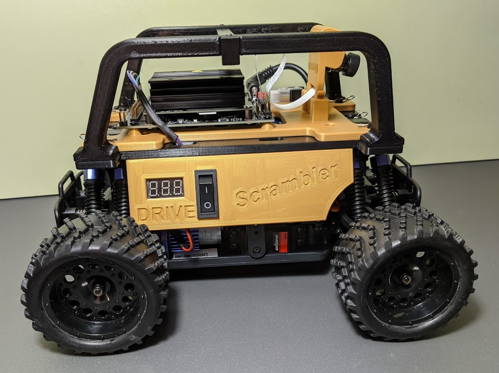

# Scrambler Donkey Car

*by Dale Jordan  
February 14, 2020*

The Donkeycar has a well established set of software tools and hardware platform for developing machine learning algorithms in a self driving car environment.
The basic donkeycar using the Jetson Nano processor was used as the starting point for the Scrambler project.
Reference documentation for the basic donkeycar can be found at: <https://docs.donkeycar.com/>.
The Scrambler Donkeycar was setup using this procedure as a guide.

Several enhancements were made to the basic hardware design.
The Jetson Nano can consume batteries rather quickly, especially if trying to run in its high power mode.
A more powerful processor battery was installed along with a power regulator and display for monitoring battery state.
A display was also added to monitor the car's drive battery state.
These additions necessitated a redesign of the 3D printed hardware for the car.

The software installation procedure of the basic car was used largely as.
There were a few caveats in the installation.
These were most likey due to changes in the updated linux kernel that produced some incompatabilities.
The steps used are listed in the [Software Installation](setup_jetson_nano.md) section.
The reference document was cut and pasted here, then annotated as necessary.

Also, when moving to a new location, the network parameters will have to be adjusted.
Tools and a procedure are outlined for doing this as a headless system.

# Getting Started

Getting started involves a few key steps:

* Unpack and finish assembling the car
* Modify the software to operate in the local environment
* Run the Donkeycar software to verify and or finish adjusting the car
