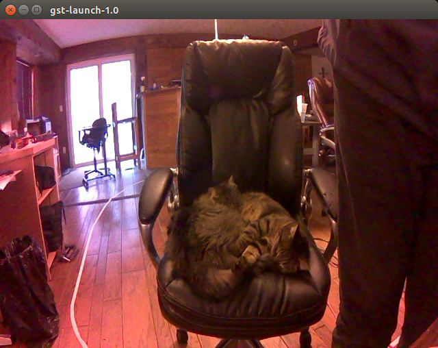

## Camera, GSTREAMER and the DISPLAY Variable

The Pi Camera is connected through the CSI port on the Jetson Nano.
This port is operated through the GSTREAMER interface.
While this interface provides a lot of useful features, it is very finicky and makes some operations like displaying camera output on a remote host difficult.
[NVIDIA Jetson Linux Driver Package Software Features](https://docs.nvidia.com/jetson/l4t/index.html#page/Tegra%20Linux%20Driver%20Package%20Development%20Guide/accelerated_gstreamer.html) and the [Accelerated GSTREAMER User Guide](https://developer.download.nvidia.com/embedded/L4T/r32_Release_v1.0/Docs/Accelerated_GStreamer_User_Guide.pdf?etbrIkKqc4UgPblFYNY4UwC_wBbLYkp5edOoRObRexGdgneeX6irzFsKiCbI91CqaxYw7yb1g_NaYOlO6L1h-nbaH7Y_QFM2-ZuK8ApcPcf53QkVRBTlBBrHa1BIw4gibQsbPIti0BOLTSqSrTCuIHU-Wb2uOrBGABFVj8fY_q8YrX50FBc) describe much about the jetson nano with numerous GSTREAMER examples.

One big issue for the linux/X11 environment is the setting of the DISPLAY variable.
When a local display is attached, the DISPLAY variable is usually something like:
```text
    DISPLAY=:0
```

The DISPLAY variable is also undefined when a simple remote login occurs:

```bash
    ssh donkey@scrambler.local
```

In both these situations, connecting to the camera works fine.

If you would like to simply send video to a remote display, or open X Windows on a remote host as in a headless situation, you might login to the Jetson Nano via:
```bash
    ssh -X donkey@scrambler.local
```
In this case, the DISPLAY variable is set to something like:

```text
    DISPLAY=localhost:10.0
```

and the camera connection cannot be established.
It is just the camera connection that breaks.
Other GSTREAMER sources, such as the video test signal generator continue to work just fine, although the sink element in the stream may need to be modified.

## Video Test Pattern Operation

To illustrate this, the following test signal script works on the local and remote display environments.

```bash
gst-launch-1.0 videotestsrc pattern=smpte ! \
        'video/x-raw, width=(int)640, height=(int)480, \
        framerate=(fraction)20/1' ! \
        xvimagesink -e
```

It produces the following display:

<div style="text-align:center"></div>
<br>

The noise pattern in the lower portion of the screen updates at normal speeds on the local display, but is very slow on the remote display, illustrating bandwidth limitations over WiFi.
In fact, a warning is issued about the speed of the computer.

## Camera Streams Run Local Display Only

When replacing the test signal generator with the camera, everything continues to run fine on the local display, but fails on the remote display.

```bash
gst-launch-1.0 nvarguscamerasrc ! \
        'video/x-raw(memory:NVMM), width=(int)640, height=(int)480, \
        format=(string)NV12, framerate=(fraction)20/1' ! \
        nvvidconv flip-method=2 ! \
        xvimagesink -e
```

<div style="text-align:center"></div>
<br>

## Fix for Remote Display Operation

One way to work around this problem is to modify the DISPLAY variable before instantiating the camera through the GSTREAMER.
This can easily be done in python using opencv.
The following code illustrates this.

```python
import os
import cv2

# Work around DISPLAY issues
disp = os.environ["DISPLAY"]
os.environ["DISPLAY"] = ':0'

# Set video size information
width = 640
height = 480
fps = 10

# Create a VideoCapture object
gst_str = ('nvarguscamerasrc ! '
    'video/x-raw(memory:NVMM), '
    'width=(int)1280, height=(int)720, '
    'format=(string)NV12, framerate=(fraction)%d/1 ! '
    'nvvidconv flip-method=2 ! '
    'video/x-raw, '
    'width=(int)%d, height=(int)%d, format=(string)BGRx ! '
    'videoconvert ! '
    'appsink' % (fps, width, height))

cap = cv2.VideoCapture(gst_str, cv2.CAP_GSTREAMER)

# Check if camera opened successfully
if (cap.isOpened() == False):
  print("Unable to read camera feed")

# Put back the display environment
os.environ["DISPLAY"] = disp

winName = "CameraWin"
cv2.namedWindow(winName, cv2.WINDOW_NORMAL)
cv2.resizeWindow(winName, width, height)
cv2.setWindowTitle(winName, "Preview")

while(True):
  ret, frame = cap.read()

  if ret == True:

    # Display the resulting frame    
    cv2.imshow(winName, frame)

    # Press q on keyboard exit
    key = cv2.waitKey(1) & 0xFF
    if key == ord('q'):         #focus must be in the display window to work
      break
    if cv2.getWindowProperty(winName, 0) < 0: #see if user closed the window
        break

  # Break the loop
  else:
    break

# When everything done, release the video capture object
cap.release()

# Closes all the frames
cv2.destroyAllWindows()
```

This now handles remote displays, however, transmitting raw video over WiFi is slow.
Compressing video before tranmission, should give the necessary improvements.

