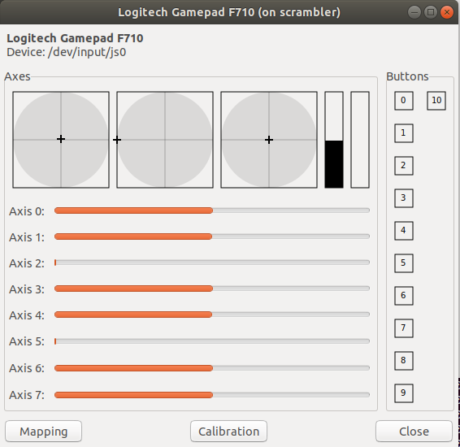

## Introduction

Explore the basic connections to interfacing with the joystick.
Looking for simple interface so that it can be used for other test programs.
In looking at the donkey car interface, they build a driver through *ioictl* calls to the joystick port in linux (*/dev/input/js0*).
Since we are only using the Logitech F710, we won't worry about the plethora of other types to interface to.

It would probably suffice to lift the necessary parts from the *controller.py* file in the donkey car, but we'll start with a standard linux test program.

When looking into the joystick interface there are many terms and definitions that come up.
The [Linux Kernel Documentation](https://www.kernel.org/doc/html/latest/input/joydev/index.html) provides a great amount of detail on this information.

## jstest-gtk

This is a simple joystick tester written in c++ and can be found at the [jstest-gtk](https://github.com/Grumbel/jstest-gtk/tree/master).

It has been downloaded into the ~/project/jstest directory.
The README.md gives the necessary instructions to compile and run it.
Before running this, you will want to remotely log in via:

```bash
ssh -X donkey@scrambler.local
```

since it brings up a window displaying the joystick controls.

Before compiling, you will also have to do the following to get thenecessary libraies:

```bash
sudo apt-get install sigc++
sudo apt-get install libgtkmm-3.0-dev
```

Once compiled it can be executed from the build directory via:

```bash
./jstest-gtk /dev/input/js0
```

<div style="text-align:center"></div>
<br>

## js_linux.py program

This [js_linux.py](https://gist.github.com/rdb/8864666) was grabbed from the internet.
It is rather simple and runs straight away, so it should serve as a vehicle to quickly generate drivers that we are interested in.
It also appears that this was the driver that the Donkeycar used to develop their joystick (controller.py) from.

## Joystick Driver

Converted js_linux.py to class Joystick and added a subclass of F710Joystick.
In addition, reading of the joystick values was converted to nonblocking I/O.
This seems to make sense for more general usage.
A timeout on the read time could also have been used, or even more generically, put a polling loop as a separate thread.

For now, it is left as a simple driver that must be polled regularly to keep the event queue on the joystick from filling up.
It keeps a current state of the joysticks and buttons.
It also can just return events as they come in.
Final tweaks can wait until we put it in an application and see what is really needed.

