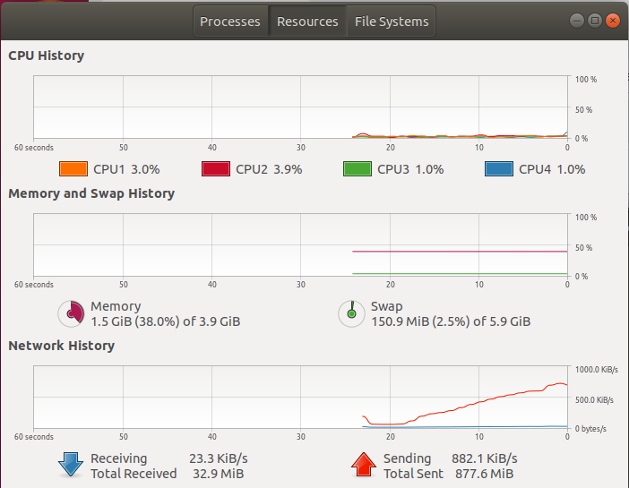
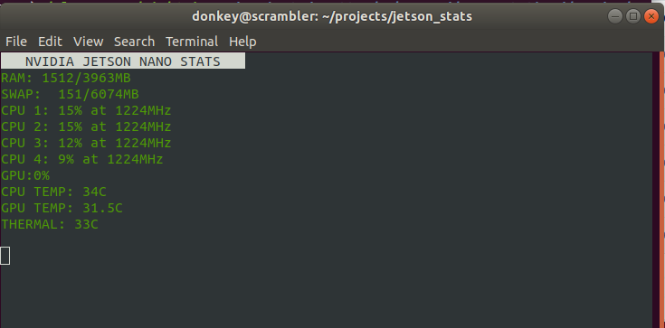

## Monitoring the Jetson Nano Remotely

One of the concerns in running headless, is knowing the status of the processor and network activity.
After looking around on the web for sources, many were found.
However, they don't necessarily monitor the things we are interested in or in the case of graphical displays, take a lot of network resources.
Many of these are written in python and provide examples on how to easily obtain the information desired.

## Example Monitoring Programs

Graphical based:

```bash
    # From host
    ssh -X donkey@scrambleer.local

    # From terminal created on nano
    gnome-system-monitor&
```

<div style="text-align:center"></div>
<br>

This brings up the standard monitor on the remote display.
It displays graphically each cpu's usage, memory and the network traffic.
Unfortunately, it adds a fair amount the network traffic, so before measuring other traffic levels, you need to get a baseline traffic level from this.
In slower environments it may require enough bandwidth, that it falls behind.

A simple cpu and gpu monitor was found at this [site](https://gist.github.com/mgrantham18/91dc07ce81f19667c58bb917db64a084).
It runs under ncurses, so is easier to call remotely.
This monitor is located in ~/projects/stat_mon/references.

```bash
    cd ~/project/stat_mon/references
    python jetson_stats.py
```

<div style="text-align:center"></div>
<br>


This program does not monitor the network activity.  To do that, we can use ifstat.
It can easily be installed via:

```bash
    sudo apt-get install ifstat
```

The source code is also available and is storedin ~/projects/stats_mon/references.
By default it adds a new line to the output every second.
This program displays activity for all the I/O ports.
To display the WiFi trafiic only:

```bash
    ifstat -i wlan0
```

## Home Grown stat_mon.py

The easiest way to get a simple stats monitor was to write a python script.
The example programs provide good reference material and were used to guide the developoment.
Most of the stats information is readily available by reading pseudo files on the processor.
Information about the contents of these files can be found in the web.

Two programs were written: *stat_mon.py* and *stat_mon_curses.py*.
They are essentially the same program, but the curses version adds a few bells to flag high usage items.

To run a program:

```bash
    # From host
    ssh donkey@scrambleer.local

    # From terminal created on nano
    cd ~/project/stat_mon
    python stat_mon.py
```

<div style="text-align:center"></div>
<br>

